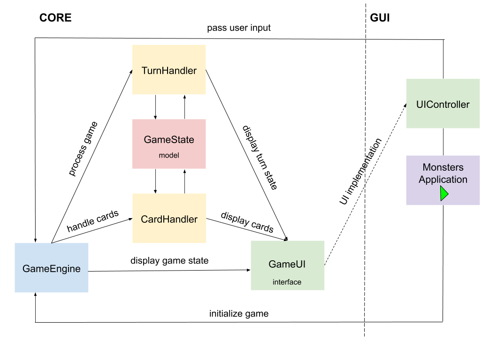

# Monsters
Simple GUI game application, inspired by my favourite board game, implemented using JavaFx.

**Game rules**  
Game is intended for three players. There are two ways user can win the game. Either by scoring 30 points or by destroying other monsters.
Player starts with 0 score points, 0 power points and 15 life points.
1. Throwing dices - player throws 6 dices, no more than three times. Each dice symbol means specific action:
* `ONE`, `TWO`, `THREE` - score points; in case of three the same numbers on three different dices monster scores corresponding number of points
* `ATTACK` - hurts other players; attacked monster loses their life points
* `HEART` - lets player heal (recover life point); only monsters outside the city centre can use this option
* `POWER` - appropriate number of power points allows user to buy a card
2. Entering the city 
* if city is empty, first player who throws at least one `ATTACK` enter the city center
* monster get 1 score point for entering the city, and 2 points for beginning the turn in the city centre
* monster in the city can not use `HEART`s to heal
* monster in the city center attacks all other users; monster outside the city attacks only monster in the city
* monster in the city who was attacked can decide to leave the city; in this case monster who attacked takes his place
3. Buying cards
* user can buy cards from bank spending `POWER` points
* there are different cards available which diversify gameplay
* cards enable for example to score extra points or add some action to dices result
## Motivation
Project was created for practicing Java coding skills.
## How to run
Project is not released, so in order to run application it is necessary to build from sources.
### Requirements
* Gradle 5.2.1
* JDK 8 with JavaFX
### Building and running
1. Clone the project
2. Run
```
gradlew run
```

## Structure



Monster project consists of two modules:

**1. Core** - module containing whole game logic
* GameEngine 
  - responsible for game initialisation
  - works as intermediary between UI and game logic
  - contains core methods for gameplay (such as `startTurn()`, `playTurn()` or `processDiceInput()`)
* GameUI - UI interface; abstracts away UI implementation from game logic
* TurnHandler - implements detail turn logic like handling dices results or switching players
* CardHandler 
  - responsible fo cards initialisation
  - implements general cards logic like buying and shuffling cards
* model package - contains all game components models; the most important are:
  - Monster - monster (player) model
  - GameState - holds current game state and parameters
  - GameResult - holds information if game is finished and who is the winner
  - DiceResultType - holds all possible dice results
  - cards package - all cards models containing their specific logic


**2. Gui** - simple JavaFx GUI application containing one game screen. This allows users to play and follow game progress.
* MonsterApplication - main project class, which sets application's scene and starts game
* UIController
  - keeps all JavaFx objects
  - responsible for handling inputs provided by the user and displaying current game progress on the screen
